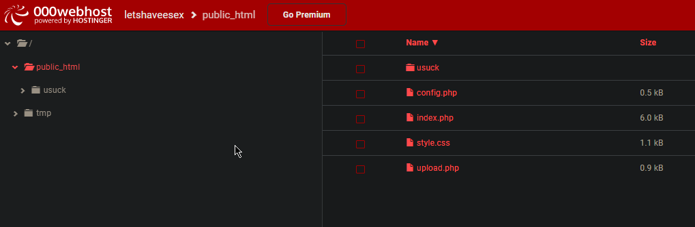
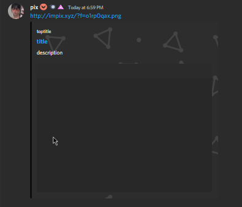
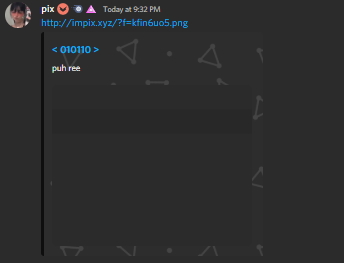

# Sharex-Img-Uploader
A Sharex IMG uploader that runs with PHP | Use a hosting site if you're a beginner use 000webhost

# Details
here is what u would do after setting up ur 000webhost site (doesn't have to be 000webhost) just put the files and setup ur config.php

# What the embed looks like
Unedited!!!

Edited Without Toptitle!!! (just leave it empty for no toptitle)

